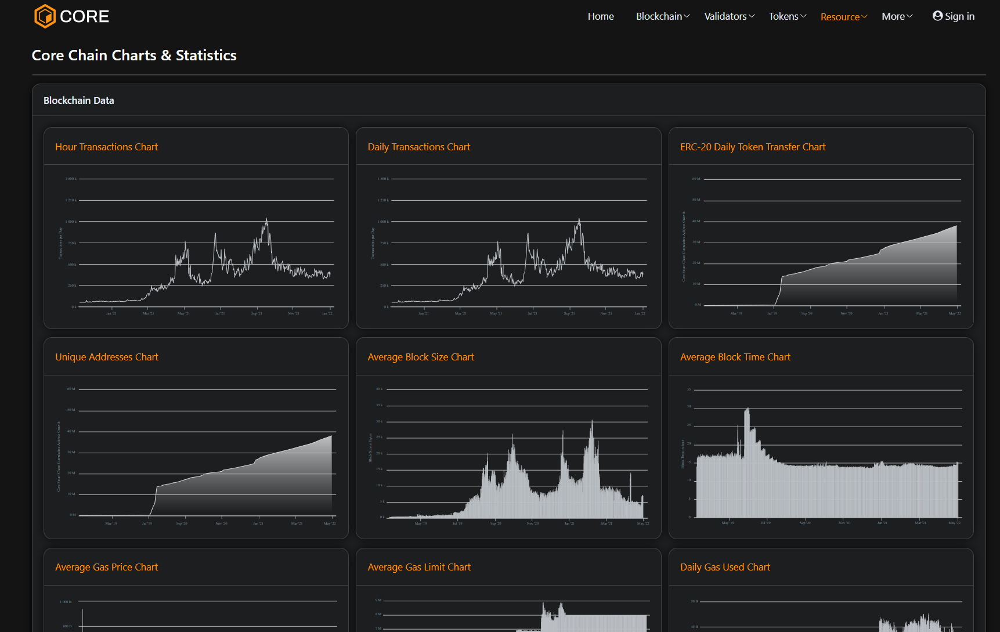
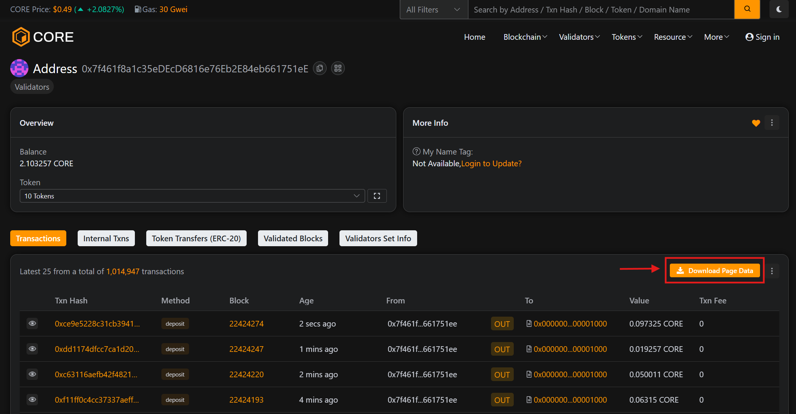
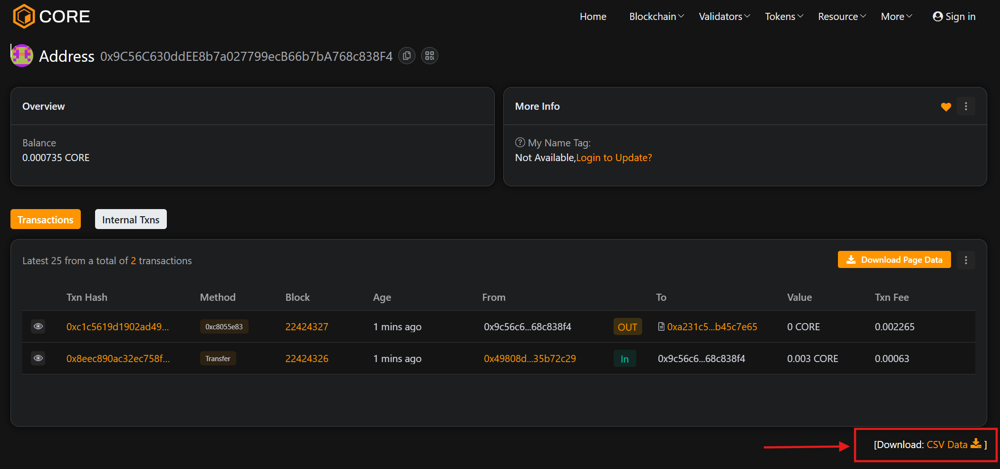
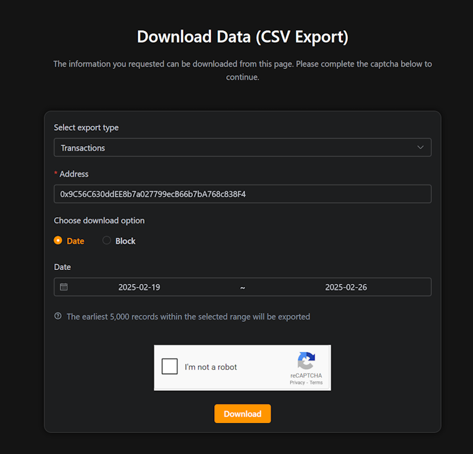
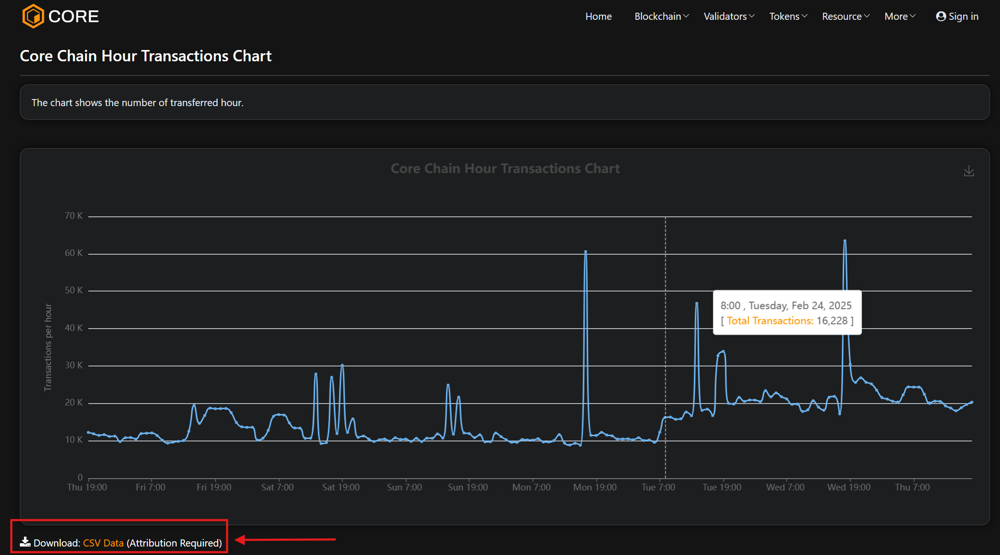

# Core Scan Blockchain Explorer
---
Core Explorer is a graphic user interface designed to allow users to interact with the CORE blockchain. Through this interface, a user can browse information about blocks that have been added to the blockchain, transactions that have occurred on the blockchain, wallet balances, and information about CORE and other supported tokens. Core Network provides explorers for both its mainnet and testnet.

## For Core Testnet 
* For Core Testnet2 (1114): https://scan.test2.btcs.network/
* For Core Testnet (1115): https://scan.test.btcs.network/

## For Core Mainnet
* For Core Mainnet (1116): https://scan.coredao.org/

## Using the Core Scan Explorer

You can use the Testnet Core Scan blockchain explorer to find and review transactions and monitor the network activity. 

### Searching for Information

You can search for various blockchain data using the search bar at the top of the page:

* **Transaction Hash:** Track the status and details of a specific transaction.
* **Block Number:** View block details, including miner information and timestamp.
* **Wallet Address:** Check balance, transaction history, and token holdings.
* **Smart Contract Address:** Inspect contract details and interactions.

### Analytics & Charts 
Core Scan block explorer features real-time insights into blockchain activity through interactive charts and analytics. In the top right navigation menu, click on **Resources** and then **Charts & Stats** to navigate to the charts for network activities.

### Downloading Transaction Data 
Core Scan block explorer also has the feature to download the blockchain and transaction data.

#### Download Transaction Data For Current View 

The **Download Page Data** button on the details page for a transaction allows users to quickly download transaction data for the current view (max 25 records).

#### Download Historial Transaction Data 

* To download historical transaction data, scroll down to the buttom of the transaction details and click on the **Download CSV Data** button.

* You will be navigated to "Download Data (CSV Export)" page. Choose the type of data you want to export, choose whether you want to export data based on a specified date range or block heights, verify the captcha and click the download button to export your required data in the CSV format. 

#### Download Chart Data 

To export the chart data from Core Scan, click on **Download:CSV Data** and your data should be exported. 

