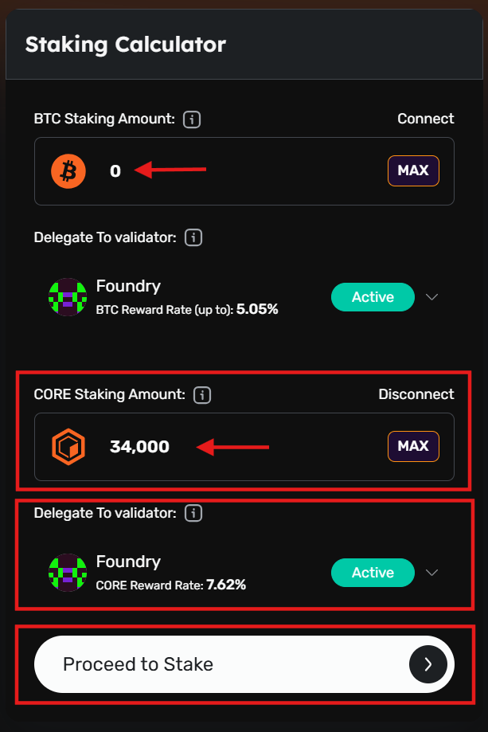
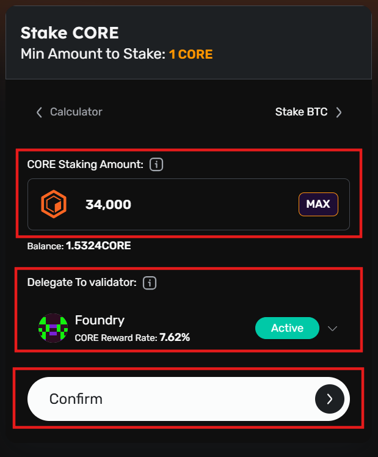
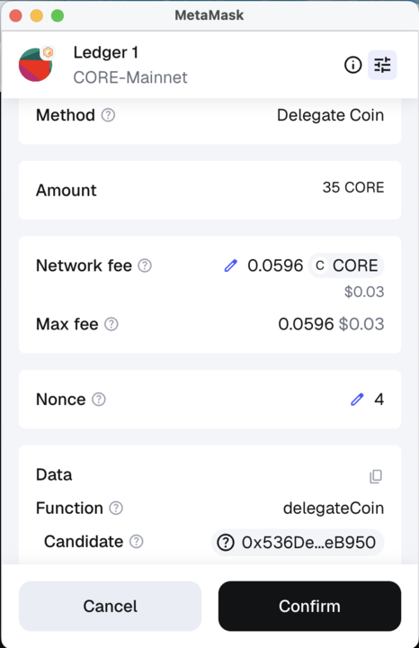
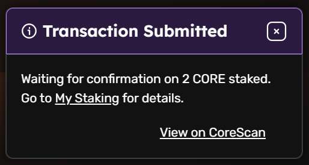

# Using Ledger Hardware Wallets for Staking CORE
---

This user guide walks you through the process of staking CORE to earn staking rewards on the Core blockchain using a Ledger hardware wallet. By following the steps below, you can participate in Core’s Satoshi Plus consensus mechanism by staking and delegating CORE.

## Before You Begin: Important Reminders

To ensure a secure and seamless experience, please note the following key requirements:

1.  **Use Only Supported Ledger Devices:** CORE staking is only supported on specific Ledger hardware wallets with the latest/supporting firmware. As a best practice, update your device through Ledger Live before proceeding.
    
2.  **Always Use the Ledger's Ethereum App:** You _must_ use Ledger's Ethereum app to stake CORE token on Core using Ledger device.

## Supported Ledger Hardware Wallets

The following Ledger hardware devices currently support staking CORE directly on the Core blockchain. For the best experience and compatibility, ensure your device is running the latest available or supported firmware.

| Ledger Device | Firmware Version (*at the time of writing*) |
| ----- | ----- |
| **Ledger Nano S+** | 1.4.0 |
| **Ledger Nano X** | 2.5.0 |
| **Ledger Stax** | 1.8.0 |
| **Ledger Flex** | 1.4.0 |

 

:::note
The firmware versions listed above reflect the latest available at the time of writing and are subject to change. Before staking CORE using your Ledger device, update to the latest version to ensure compatibility and security. Always check Ledger Live for the most current updates. Refer [here](https://support.ledger.com/article/8458939792669-zd) for more details on updating the Ledger drive firmware.
:::

## Prerequisites

Before you begin, make sure you have:

-   A supported Ledger device with the latest firmware.
-   Ledger Live is installed and set up on your computer.
-   Your Ledger device is added to your EVM Wallet that you desire to use (e.g., MetaMask)
-   Sufficient CORE tokens (minimum 1 CORE) available on your Ledger device for staking, including tokens to cover transaction fees. 

## Setting up Ledger Device

Before staking CORE, make sure your Ledger hardware wallet is fully updated and ready to use with the Core blockchain.

### Step 1: Update Your Ledger Device

Ensure your Ledger device is updated and ready for use.

1.  Open **Ledger Live** on your computer.
2.  Connect and unlock your Ledger device.
3.  Navigate to **My Ledger** in the sidebar.
4.  If prompted, allow **Ledger Manager** access on your device.
5.  Install any available firmware updates for your device, skip if your device has the latest supported firmware.
    
### Step 2: Installing the Ledger Ethereum app

Follow the steps below to install the Ledger Ethereum app on your device.

1.  With your device connected to your computer, open the Ledger Live application and navigate to "**My Ledger**".
    
2.  Under the "**App Catalog**", search for "**Ethereum**".
    
3.  Install the "**Ethereum**" app. Use _only_ the Ledger Ethereum app for staking CORE using Ledger on Core Mainnet. For more details, refer to the [official guide](https://support.ledger.com/article/360009576554-zd) from Ledger for installing the Ethereum app on your device.

 

### Step 3: Enable Blind Signing on Ledger Ethereum App

Note that before staking CORE, users have to enable blind signing in the settings of the Ethereum App on the Ledger Device. Refer to the [official guide](https://support.ledger.com/article/4405481324433-zd) from Ledger for more details.

### Step:4: Add Ledger Device to Your EVM Wallet

Before proceeding with staking CORE using Ledger, it is important to add your Ledger device to the EVM wallet (e.g., MetaMask, etc.) you will be using to connect your Ledger for staking CORE.

For this guide, MetaMask wallet configured with Core Mainnet was used. Refer to the [official guide](https://support.ledger.com/article/4404366864657-zd) from Ledger for details on how to add your Ledger device to the MetaMask wallet.

## Staking CORE Using Ledger Device

With your Ledger device connected to your computer and the Ledger Ethereum app installed, you can securely stake CORE directly from your hardware wallet.

:::info
A minimum of **1 CORE** is required to participate in staking CORE tokens on Core Mainnet, along with sufficient CORE tokens to cover transaction fees.
:::

1.  On your Ledger device, open the Ledger Ethereum app before proceeding.

2.  Navigate to the [Core Staking Websit](https://stake.coredao.org/staking).    

### Connect Core Wallet to the Staking Website

1.  Connect your Core Mainnet wallet to the website. Make sure it is the same wallet you connect your Ledger device with, as this will be used as the wallet for staking CORE.
    
2.  Click on the "**Connect Wallet**" button in the top right corner of the website.
    

3.  From the displayed wallet modal, select the wallet of your choice configured for use with Core Mainnet.
    

### Specify and Confirm Staking Details

1.  On the Core Staking [page](https://stake.coredao.org/staking), with your EVM wallet connected to the staking website, specify the amount of CORE to stake. Click "**Proceed to Stake**". 
    

 

2.  Confirm the CORE amount to stake and the validator to delegate your stake to participate in the Core consensus mechanism and earn staking rewards. Click "**Confirm**" to proceed.
    

   

3.  The user will see a modal directing them to approve the transaction on their connected EVM wallet.

  

4. Approve the transaction on your connected EVM wallet notification.

### Approve Transaction on Ledger Device

1.  Approve the staking transaction on your Ledger device.

2.  Once approved on your Ledger device, the "Transaction Submitted" notification will appear on the Core Staking website.
    

  
3.  Click on "**View on Core Scan**" to view details of your CORE staking transaction on the Core Scan block explorer.

:::note
To be eligible to earn rewards, you must complete a full staking round on (00:00:00 - 23:59:29 UTC).
:::

## FAQs
Have more questions? Check out the [FAQs](../FAQs/ledger-core-faqs.md) section for answers to common issues, troubleshooting, and best practices.

## Conclusion

Congratulations! You’ve successfully staked CORE using your Ledger hardware wallet on the Core Mainnet. By following this guide, you securely connected your Ledger device, installed and used the Ledger Ethereum app, to stake CORE directly from your hardware wallet to earn staking rewards.
