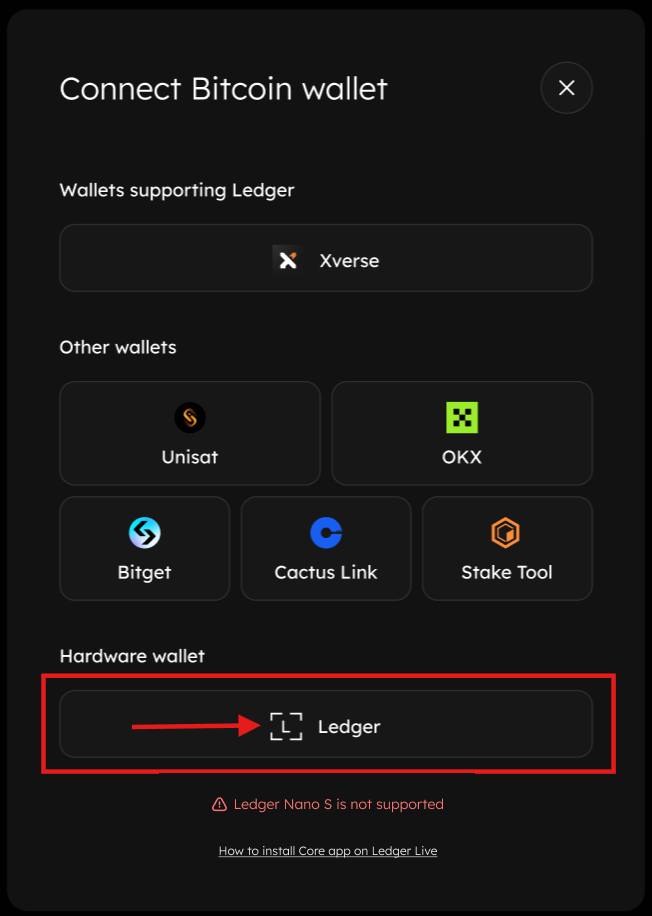
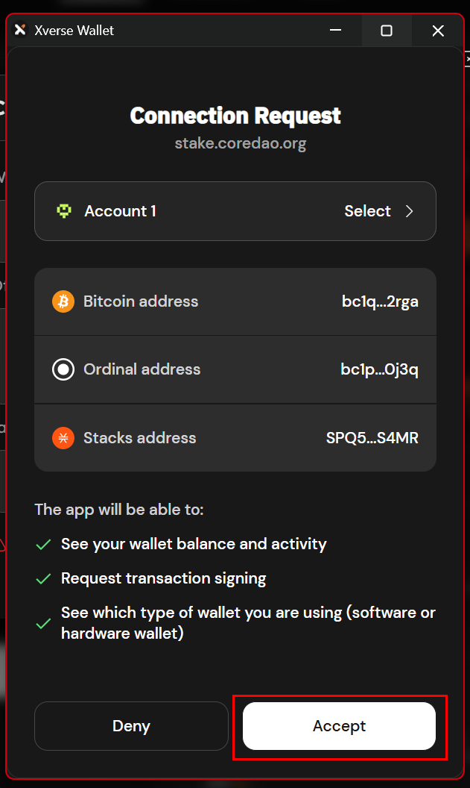
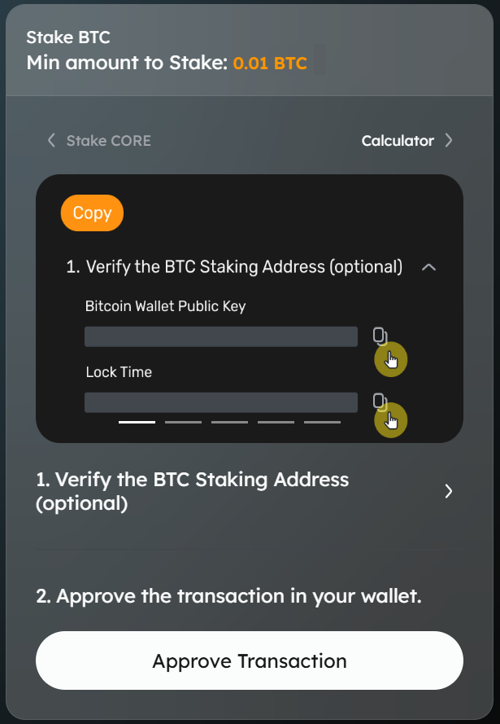
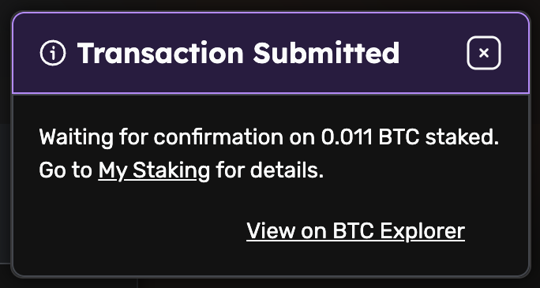

# Using Ledger Hardware Wallets for BTC Staking on Core 
---

This user guide walks you through the process of staking BTC to earn CORE rewards on the Core blockchain using a Ledger hardware wallet. By following the steps below, you can participate in Core’s Self-Custodial Bitcoin Staking while maintaining complete control of your assets.

## Before You Begin: Important Reminders

To ensure a secure and seamless experience, please note the following key requirements:
* **Use Only Supported Ledger Devices:** Bitcoin staking, redemption, and redelegation on Core is only supported on specific Ledger hardware wallets with the latest firmware. Always update your device through Ledger Live before proceeding.
* **Stake BTC Only from the Primary BTC Wallet Address:** BTC staking is currently supported from your Ledger’s primary BTC wallet address only. Secondary or derived addresses are currently not compatible. Please refer to our [FAQs](../../../../FAQs/ledger-core-faqs.md) for instructions on how to create a new address or identify your primary address.
* **Only Native SegWit Bitcoin Addresses are Supported:** Currently, only Native SegWit Bitcoin addresses are supported for BTC staking via Ledger hardware. 

## Supported Ledger Hardware Wallets
The following Ledger hardware devices currently support staking, redemption, and redelegation of BTC on the Core blockchain. For the best experience and compatibility, ensure your device is running the latest available firmware.

| Ledger Device | Firmware Version (*at the time of writing*) |
| ----- | ----- |
| **Ledger Nano S+** | 1.4.0 |
| **Ledger Nano X** | 2.5.0 |
| **Ledger Stax** | 1.8.0 |
| **Ledger Flex** | 1.4.0 |

 

:::note
The firmware versions listed above reflect the latest available at the time of writing and are subject to change. Before timelocking, redeeming, or redelegating Bitcoin on Core using your Ledger device, ensure you update to the latest version to maintain compatibility and security. Always check **Ledger Live** for the most current updates. Refer [here](https://support.ledger.com/article/8458939792669-zd) for more details on updating the Ledger device firmware. 
:::

## Prerequisites
Before you begin, make sure you have:
* A supported Ledger device with the latest firmware.
* Ledger Live is installed and set up on your computer.
* You need to have a BTC address on your Ledger device, which can be acquired through either Ledger Live or the Xverse wallet. 
    * BTC addresses created via wallets other than Xverse and Ledger Live have not been tested - use at your own risk.
    * For Xverse Wallet, add your Ledger device to the Xverse Wallet.
* Sufficient BTC (minimum 0.01 BTC) available on your Ledger device for staking.

## Setting up Ledger Device
Before staking BTC on Core, make sure your Ledger hardware wallet is fully updated and ready to use with the Core blockchain.

### Step 1: Update Your Ledger Device
Ensure your Ledger device is updated and ready for use. 

1. Open **Ledger Live** on your computer.
2. Connect and unlock your Ledger device.
3. Navigate to **My Ledger** in the sidebar.
4. If prompted, allow Ledger Manager access on your device.
5. Install any available firmware updates for your device.

### Step 2: Installing the Ledger Core app
Follow the steps below to install the Core app on your device. 

1. With your device connected to your computer, open the Ledger Live application and navigate to "**My Ledger**".
2. Under the "**App Catalog**", search for "**Core**".
3. Install the "**Core**" app. Use only the Core app for staking, redemption and redelegation of locked Bitcoin on Core Mainnet.

:::info 
Always use the Core app for staking, redeeming or redelegating Bitcoin on Core Mainnet. The standard Bitcoin app does not support redemption operations on Core and may result in permanent loss of access to your timelocked BTC. Unlike the Ledger Bitcoin app, which uses blind signing where transaction details are obscured from the user, the Ledger Core app enables Clear Signing.
Clear Signing displays all transaction information (e.g., amount, validator, fees, and addresses) directly on your Ledger device screen, providing you with complete visibility. This enables you to verify what you’re signing confidently and protects you from unintended or malicious transactions. For more details on Clear Signing, refer [here](https://www.ledger.com/academy/topics/ledgersolutions/what-is-clear-signing).
:::

### Step#3: Setting up Bitcoin Address on Ledger Device
Currently, staking from a Ledger device is only supported via the primary Bitcoin account on the Ledger device. 

* If you have a new Ledger device, the first Bitcoin account you set up is the primary account. Refer [here](../../../../FAQs/ledger-core-faqs#8-how-do-you-set-up-a-bitcoin-address-on-a-ledger-device-using-ledger-live) for detailed steps on setting up the Bitcoin Address on your Ledger device using Ledger Live. 
* If you already have multiple Bitcoin accounts set up on your ledger device, refer [here](../../../../FAQs/ledger-core-faqs#9-how-do-you-set-up-a-bitcoin-address-on-a-ledger-device-using-xverse-wallet) for instructions on identifying the primary account.

> ⚠️ **Disclaimer:** _Currently, only Bitcoin addresses generated through Ledger Live and Xverse Wallet have been thoroughly tested and verified for compatibility. Addresses created using other wallets have not yet been tested, and functionality cannot be guaranteed. Users choosing to proceed with untested wallets should do so at their own risk._

## Staking BTC on Core with Ledger 

With your Ledger device connected and the Core app installed, you can securely stake BTC directly from your hardware wallet.

> ⚠️ **Note:** A minimum of 0.01 BTC is required to participate in Bitcoin staking on Core Mainnet, along with sufficient BTC to cover transaction fees. For more details on setting up your first Bitcoin Account on a Ledger device, refer here.

1. On your Ledger device, open the **Core app** before proceeding.

2. Navigate to the [Core BTC Staking Website](https://stake.coredao.org/staking).

### Connect Core Wallet to the Staking Website

1. Connect your Core Mainnet wallet to the website. This will be used as the CORE reward address.

2. Click on the "**Connect**" button in the top right corner of the website. From the displayed wallet modal, select the wallet of your choice configured for use with Core Mainnet. 

### Connect Ledger Hardware Wallet to Website 
Before connecting your Ledger device to the website, ensure you are using your Ledger device’s primary Bitcoin (BTC) account for staking BTC on Core. Refer to the [official guide from Ledger](https://support.ledger.com/article/115005195945-zd) to set up a Bitcoin (BTC) account on your device, if you haven't already done so. 

#### Staking Option One: Connect Ledger Wallet Directly

1. On the [Core Bitcoin Staking Website](https://stake.coredao.org/staking), click on "**Connect**" next to BTC Stake Amount. Remember, only the primary account is supported for staking BTC; ensure it is the same account connected to your Ledger Live. 

2. From the displayed wallet modal, under "**Hardware Wallet**", click on "**Ledger**". Ensure your Ledger is connected, unlocked, and the Core app is open. Note that only the Bitcoin Native SegWit type addresses are supported for BTC staking on Core with Ledger.

#### Staking Option Two: Connecting Ledger Device Using Xverse Wallet 
Alternatively, users can also use Xverse to stake Bitcoin from their Ledger device. To achieve this, users must first add their Ledger device to their Xverse wallet as a prerequisite. Refer to the [official guide by Xverse](https://support.xverse.app/hc/en-us/articles/17819233917965-How-to-Connect-Your-Ledger-Device-to-Xverse) to connect your Ledger device with Xverse.

1. On the [Core Bitcoin Staking page](https://stake.coredao.org/staking), click on "**Connect**" next to BTC Stake Amount. Remember, only the primary account is supported for staking BTC; ensure it is the same account connected to your Ledger Live. 

2. From the displayed wallet modal,  click on "**Xverse**" under "**Wallets Supporting Ledger**". Make sure your Ledger device is unlocked.

3. Unlock your Ledger device and confirm the connection via the Xverse wallet extension.

> ⚠️ **Note:** Only the primary Bitcoin account on the Ledger device is supported to stake BTC; ensure it is the same account connected to the Xverse wallet and used for staking purposes. 

### Specify & Confirm BTC Staking Details

1. **Specify BTC Staking & Delegation Details:** Once both Core and Bitcoin wallets are connected, specify the amount of BTC to stake. Select the desired Core validator to delegate your Bitcoin to. To proceed with BTC staking, specify the CORE Staking Amount as zero. Click the "**Proceed to Stake**" button. 

2. **Skip CORE Staking Details:** Users can skip this step and click directly on "Stake BTC" to proceed with staking only Bitcoin by verifying Bitcoin staking details.

3. **Confirm BTC Staking Details:** Verify the amount of BTC to be staked. Before finalizing, specify key parameters:
    * Confirm the BTC amount you'd like to stake (minimum 0.01 BTC).
    * Set the lock time to determine when your Bitcoin will be unlocked. Please note that the website's user interface displays the lock time based on the user's local time, which may differ from the time zone of the Ledger device, which is UTC.
    * Specify the network priority speed for your transaction.

4. **Verify Bitcoin Staking Address (Optional):** Use the Bitcoin Staking Address verification tool to confirm that the displayed BTC staking address matches your expected address before proceeding.

5. **Proceed to Approve Transaction:** Click on "Approve Transaction" on the website to proceed with the transaction.

### Review and Approve Transaction on Ledger Device

#### Using Xverse Wallet
1. If using an Xverse wallet, review the transaction. Verify details and click "**Confirm**" on the wallet notification on your browser. 

2. Click "**Connect**" on the "**Connect Your Ledger**" modal.

3. Proceed to confirm and approve the transaction on your Ledger device. 

#### Approve BTC Staking Transaction on the Ledger Device
1. Ensure your device is unlocked and the Core app is open. Review and approve the BTC staking transaction on your Ledger device. Verify the staking details, including the amount of BTC, the validator and delegator addresses, and the transaction fees. Approve by signing the transaction.

2. Once approved on your Ledger device, the "**Transaction Submitted**" notification will appear on the Core BTC Staking website. 

3. Click on "**View on BTC Explorer**" to view details of your BTC staking transaction on the BTC Explorer.

> ⚠️ **Note:** To be eligible to earn rewards, you must complete a full staking round (00:00:00 - 23:59:29 UTC).

## Conclusion
Congratulations! You've successfully staked Bitcoin on Core using your Ledger hardware wallet, leveraging its security and Core's self-custodial model for complete asset control and transparent signing via the Core app. Welcome to the Core ecosystem, where security, control, and yield are paramount!
